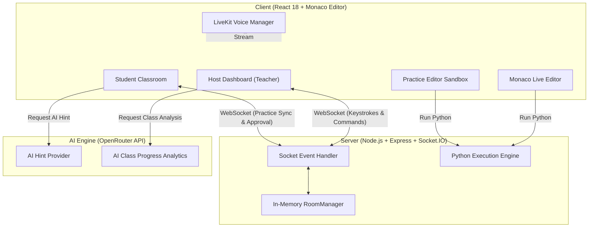

# Classora — Real-Time Collaborative Virtual Classroom & Interactive Coding Platform

> **Hackathon Project Documentation**  
> **Project Name:** Classora  
> **Repository:** [GitHub Repository](https://github.com/Mdumar0715/classora)  
> **Live Web Application (Vercel):** [https://client-nine-sand-55.vercel.app](https://client-nine-sand-55.vercel.app)  
> **Live Backend Engine (Render):** [https://classora-3s1d.onrender.com](https://classora-3s1d.onrender.com)  

---

## 📋 Executive Summary

**Classora** is a state-of-the-art, high-performance virtual classroom platform built for computer science education and interactive coding sessions. It addresses the fundamental flaw of traditional video-conferencing tools (Zoom, Google Meet, Teams) in technical learning: **passive observation without active participation**.

Classora seamlessly merges **live teacher broadcasting**, **real-time code synchronization**, **sandboxed student practice environments**, **low-latency voice communication**, and **AI-powered progress analytics** into a single ultra-sleek web application.

---

## 🎯 1. Objective & Problem Statement

### The Problem
Traditional online coding classes suffer from severe friction:
1. **Passive Screen Sharing**: Students view static, low-framerate video streams of code rather than interactive code editors.
2. **Context Switching Chaos**: Students constantly switch between video calls, local IDEs (VS Code, PyCharm), terminal windows, and messaging apps.
3. **Teacher Blindspots**: In a virtual room of 30+ students, a teacher cannot see who is stuck, who is falling behind, or who needs instant code guidance.
4. **Setup Bottlenecks**: Setting up local compilers/interpreters consumes valuable class time.

### The Objective
To build an all-in-one, zero-installation, zero-database collaborative classroom platform where:
- Teachers can broadcast code, execute Python scripts, and monitor student progress live.
- Students can read live broadcast code, branch off into their own practice sandboxes, request AI hints, and run Python code safely.
- Communication is effortless via integrated voice channels, hand-raising queues, and live code inspection.

---

## 🛠️ 2. Tech Stack & Architecture

### Tech Stack Overview

| Layer | Technology | Purpose |
| :--- | :--- | :--- |
| **Frontend Framework** | **React 18 + Vite** | Ultra-fast single page application (SPA) with hot module reloading |
| **Language** | **TypeScript** | Strict type safety across client, server, and shared interfaces |
| **Code Editor** | **`@monaco-editor/react`** | VS Code Dark themed Monaco editor for Python broadcasting and practice |
| **Real-Time Engine** | **Socket.IO (WebSockets)** | Full-duplex bidirectional event stream for keystrokes, voice state, and approvals |
| **Styling & UI** | **TailwindCSS + Custom Glassmorphism** | Modern dark-mode aesthetic with CSS grid/flexbox responsiveness |
| **Voice Engine** | **LiveKit Cloud & Web Audio WebRTC PCM** | Low-latency audio streaming, mute controls, and speaker permission relay |
| **Code Execution** | **Pyodide / Sandboxed Execution Service** | In-browser & server Python execution with standard input (`stdin`) handling |
| **AI Integration** | **OpenRouter API** | LLM integration for AI student hint generation and class progress analysis |
| **Deployment** | **Vercel (Client) & Render Cloud (Server)** | Continuous deployment via GitHub triggers |

---

## 🏗️ 3. Architecture & Key Systems Design

---

## 💡 4. Technical Approach & Innovation

### A. Zero-Database In-Memory State Architecture
Classora operates on an efficient **in-memory room state model**:
- Rooms, connected students, pending join requests, live editor contents, and practice problem states are maintained in a high-speed `RoomManager` memory store.
- **Benefits**: Zero database overhead, instant room creation, sub-50ms synchronization latency, and automatic memory cleanup when sessions end.

### B. Reliable Dual-Mode Workspace System
Students can seamlessly switch between **Teacher Broadcast View**, **Individual Practice View**, and **Side-by-Side Split Screen View**:
- **Teacher View**: Full-width live editor displaying the teacher's keystrokes and execution output in real time.
- **My Practice View**: Dedicated sandbox equipped with practice problems, Python execution, AI hints, and custom input (`stdin`).
- **Split View**: Resizable responsive layout adapting smoothly between desktop side-by-side flexbox and mobile stacked containers.

### C. Persistent Local Draft Engine
To prevent code loss during network drops or socket re-subscriptions:
- Student identity (`studentId`) and practice code drafts are saved continuously in `sessionStorage`.
- Socket re-connections restore the student's exact draft state without overwriting their work.

### D. Live AI Mentor & Automated Progress Analytics
- **AI Student Hinting**: Integrated OpenRouter AI analyzes student code, stderr, and output to provide step-by-step hints without revealing the exact solution.
- **Class Progress Dashboard**: Analyzes the entire room's code progress in real time to give teachers actionable insights on who is excelling and who needs help.

### E. Waiting Room & Permission Control
- Students enter a live waiting room upon requesting access.
- Teachers approve or reject students with single-tap or bulk-approval capabilities.
- Voice permissions are managed via a raised-hand queue with single-speaker microphone controls.

---

## ⚡ 5. Key Features

1. 👨‍🏫 **Live Keystroke Broadcasting**: Real-time Python editor syncing teacher code to all connected students.
2. 💻 **Practice Sandboxes**: 25+ built-in practice problems ranging from Easy to Hard with example inputs/outputs.
3. 📋 **Fork Teacher Code**: 1-click feature allowing students to clone the teacher's live code directly into their practice sandbox.
4. 🤖 **AI Assistant & Hint Panel**: OpenRouter-powered hint assistant providing targeted feedback on code bugs.
5. 🎙️ **Discord-Style Sleek Voice Rail**: Low-latency voice channels with raised-hand indicators and mute management.
6. 📊 **Teacher Inspection & Live Fix Push**: Teachers can remotely inspect any student's practice editor and push live code fixes directly.
7. 🎨 **Modern Dark Glassmorphism UI**: High-end visual aesthetic designed with vibrant gradients, status badges, and JetBrains Mono typography.

---

## 🌐 6. Deployment & Live URLs

- **Frontend Application (Vercel)**: [https://client-nine-sand-55.vercel.app](https://client-nine-sand-55.vercel.app)
- **Backend Service (Render)**: [https://classora-3s1d.onrender.com](https://classora-3s1d.onrender.com)
- **GitHub Repository**: [https://github.com/Mdumar0715/classora](https://github.com/Mdumar0715/classora)

---

## 🔮 7. Future Expansion & Roadmap

- **Multi-Language Support**: Expanding beyond Python to support JavaScript/TypeScript, C++, and Java.
- **Automated Test Suites**: Unit testing runner to automatically grade student submissions against test cases.
- **Multi-Teacher Co-Hosting**: Granting assistant teaching permissions for breakout rooms and co-teaching.

---

*Classora — Learn Together. Live.*
