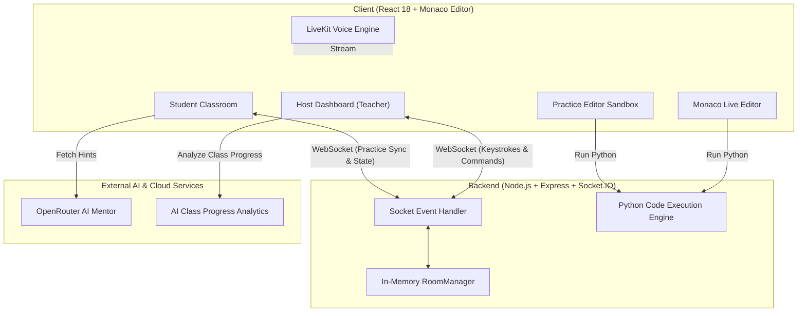

# 🚀 Classora — Real-Time Collaborative Virtual Classroom & Interactive Coding Platform

[](https://client-nine-sand-55.vercel.app)
[](https://classora-3s1d.onrender.com)
[](LICENSE)
[](https://www.typescriptlang.org/)
[](https://reactjs.org/)

**Classora** is a production-ready, ultra-low latency virtual classroom platform designed specifically for technical lectures, live programming sessions, and interactive computer science education. 

It solves the core bottleneck of traditional video-conferencing tools (Zoom, Google Meet, Microsoft Teams) in technical learning: **passive screen-watching without hands-on coding**. Classora combines live code broadcasting, individual student practice sandboxes, voice streaming, AI mentoring, automated progress analytics, and remote code inspection into a unified, zero-setup web application.

---

## 🌐 Live Production Links

- 💻 **Frontend Web Application (Vercel)**: [https://client-nine-sand-55.vercel.app](https://client-nine-sand-55.vercel.app)
- ⚙️ **Backend WebSocket Server (Render Cloud)**: [https://classora-3s1d.onrender.com](https://classora-3s1d.onrender.com)
- 🐙 **GitHub Repository**: [https://github.com/Mdumar0715/classora](https://github.com/Mdumar0715/classora)

---

## 📖 Table of Contents

- [Motivation & Problem Statement](#-motivation--problem-statement)
- [Detailed Feature Explanation](#-detailed-feature-explanation)
- [System Architecture & Design](#-system-architecture--design)
- [Tech Stack](#-tech-stack)
- [Step-by-Step Local Setup Guide](#-step-by-step-local-setup-guide)
- [Project Directory Structure](#-project-directory-structure)
- [Socket.IO Event Protocol Reference](#-socketio-event-protocol-reference)
- [Deployment Guide](#-deployment-guide)
- [License & Contribution](#-license--contribution)

---

## 🎯 Motivation & Problem Statement

### The Challenge with Traditional Video Tools
When teaching programming online, video calls fail due to four structural friction points:
1. **Static Video Streams**: Screen-sharing transmits blurry, low-framerate video frames of code, making it impossible for students to copy, run, or edit along with the teacher.
2. **Context Switching**: Students constantly alt-tab between a video call window, a local IDE (VS Code/PyCharm), terminal windows, and external chat apps.
3. **Teacher Blindspots**: In virtual classrooms with 20+ students, teachers cannot see who is stuck, who has syntax errors, or who is falling behind.
4. **Environment Setup Friction**: Spending hours troubleshooting local compiler/interpreter installations wastes valuable lecture time.

### The Classora Solution
Classora unifies the entire technical learning loop into a browser-based SPA:
- **Teachers** write and execute code in a VS Code-themed Monaco Editor broadcasted live with sub-50ms latency.
- **Students** observe live broadcast code, branch off into private practice sandboxes, run Python code with custom inputs (`stdin`), and ask an AI mentor for targeted hints.
- **Real-Time Visibility**: Teachers can inspect any student's practice editor live, push code fixes directly, and analyze room-wide progress through AI analytics.

---

## 🔥 Detailed Feature Explanation

### 1. ⚡ Real-Time Keystroke & Terminal Broadcasting
- Powered by WebSockets (Socket.IO), every character typed by the teacher in the broadcast editor is transmitted instantly to all approved student clients.
- Python execution results (standard output, standard error, execution time) stream live to student terminals as the teacher runs code.

### 2. 💻 Dual-Workspace Engine (Broadcast & Practice Sandbox)
Students can switch seamlessly between three viewing modes using the header control bar:
- 📺 **Teacher View**: Full-width focus on the teacher's live broadcast editor and terminal.
- 💻 **My Practice View**: Dedicated sandbox containing problem instructions, an editable Monaco editor, custom `stdin` panel, and execution terminal.
- 📱/💻 **Split View**: Resizable split screen rendering the Teacher Broadcast on the left and Student Practice Sandbox on the right. Automatically converts from side-by-side flexbox on desktop to clean stacked containers on mobile/tablet screens.

### 3. 🔒 Waiting Room & Real-Time Access Control
- Prevents unauthorized room access. When a student enters a room code, they are placed in a live waiting queue.
- Hosts receive instant notifications with options to **Approve**, **Reject**, or **Approve All** waiting students with a single click.

### 4. 💾 Session-Backed Local Draft System (Zero Code Loss)
- Student identities (`studentId`) and practice editor drafts are backed continuously in `sessionStorage` (`classora_practice_<roomId>`).
- If a student accidentally refreshes their page or experiences network flickers, their written code is restored automatically without wiping out their work.

### 5. 🤖 OpenRouter AI Student Mentor
- Integrated AI mentor powered by OpenRouter LLM API.
- Students can request AI hints when stuck on a practice problem. The AI inspects problem criteria, student code, and error tracebacks to provide guided hints without revealing the full solution.

### 6. 📊 Teacher AI Progress Dashboard
- Teachers can initiate an AI-powered room analysis that scans all student code editors in real time.
- Categorizes students into progress tiers (**Thriving**, **On Track**, **Struggling**, **Needs Assistance**) and highlights specific error patterns.

### 7. 🎙️ LiveKit Voice & WebAudio PCM Relay Engine
- High-quality, low-latency audio transmission for live lecturing.
- Features student hand-raising queues, 1-click mute-all controls, and granular speaker permission grants by the teacher.

### 8. 📋 1-Click "Fork Teacher Code"
- Allows students to clone the teacher's current live broadcast code directly into their private practice editor with a single tap.

---

## 🏗️ System Architecture & Design



### In-Memory Zero-Database Architecture
Classora does not rely on traditional SQL or NoSQL databases:
- All room states, student rosters, editor contents, voice states, and active practice problems are stored in a high-performance in-memory service (`RoomManager`).
- When a class ends, the room memory is safely purged, keeping memory overhead minimal and eliminating database maintenance costs.

---

## 🛠️ Tech Stack

### Frontend (`client/`)
- **Core**: React 18, TypeScript, Vite
- **Code Editor**: `@monaco-editor/react` (VS Code Dark Python theme)
- **Styling**: TailwindCSS, Glassmorphism CSS utilities, JetBrains Mono font
- **Routing**: React Router v6
- **Real-Time Client**: Socket.IO Client
- **Icons**: Lucide React
- **Hosting**: Vercel SPA Engine

### Backend (`server/`)
- **Runtime**: Node.js, Express
- **Language**: TypeScript (`tsx`)
- **Real-Time Server**: Socket.IO (WebSockets)
- **Execution Service**: Sandboxed Pyodide / Custom Python runner
- **AI Service**: OpenRouter API (`fetch`)
- **Hosting**: Render 24/7 Cloud

---

## 💻 Step-by-Step Local Setup Guide

Follow these instructions to run Classora on your local machine.

### 1. Prerequisites
Ensure you have the following software installed:
- **Node.js**: v18.0.0 or higher ([Download Node.js](https://nodejs.org/))
- **npm**: v9.0.0 or higher (comes with Node.js)
- **Git**: ([Download Git](https://git-scm.com/))

---

### 2. Clone the Repository
Open your terminal and clone the repository:
```bash
git clone https://github.com/Mdumar0715/classora.git
cd classora
```

---

### 3. Install Dependencies

Install root dependencies as well as subproject dependencies for both `client` and `server`:

```bash
# Install root workspace packages
npm install

# Install client dependencies
cd client
npm install

# Install server dependencies
cd ../server
npm install

# Return to root directory
cd ..
```

---

### 4. Configure Environment Variables

#### A. Client Environment Setup
Create a `.env` file in the `client/` directory:
```bash
# Location: classora/client/.env
VITE_SOCKET_URL=http://localhost:5000
```

#### B. Server Environment Setup
Create a `.env` file in the `server/` directory:
```bash
# Location: classora/server/.env
PORT=5000
ALLOWED_ORIGINS=*
GROQ_API_KEY=your_optional_openrouter_or_groq_api_key
```

---

### 5. Start Local Development Servers

You need to run both the backend server and frontend development client.

#### Option 1: Concurrent Startup (Recommended from Root)
From the root `classora/` folder:
```bash
npm run dev
```

#### Option 2: Manual Terminal Startup

**Terminal 1 (Backend Server):**
```bash
cd server
npm run dev
```
*Backend server will start at `http://localhost:5000`.*

**Terminal 2 (Frontend Client):**
```bash
cd client
npm run dev
```
*Frontend client will start at `http://localhost:5173`.*

---

### 6. Accessing the Application
Open your browser and navigate to:
```text
http://localhost:5173
```
- Click **"Host a Classroom"** to start a session as a teacher.
- Open a second browser tab / incognito window, navigate to `http://localhost:5173`, and click **"Join Classroom"** using the generated 6-character room code to simulate a student joining!

---

## 📁 Project Directory Structure

```text
classora/
├── client/                         # Frontend React SPA
│   ├── src/
│   │   ├── components/             # UI Components
│   │   │   ├── classroom/          # Classroom Components
│   │   │   │   ├── CustomInputPanel.tsx    # Python stdin input box
│   │   │   │   ├── ForkButton.tsx          # Fork teacher code button
│   │   │   │   ├── HintPanel.tsx           # AI hint drawer
│   │   │   │   ├── LiveEditor.tsx          # Teacher Monaco broadcast view
│   │   │   │   ├── PracticeEditor.tsx      # Student Monaco sandbox
│   │   │   │   ├── PracticeToolbar.tsx     # Practice control buttons
│   │   │   │   ├── ProblemPanel.tsx        # Problem description & test cases
│   │   │   │   ├── ResizableSplitLayout.tsx# Split screen flex container
│   │   │   │   ├── SleekVoiceSidebar.tsx   # Discord voice channel rail
│   │   │   │   ├── StudentListPanel.tsx    # Roster & permissions panel
│   │   │   │   ├── StudentProgressDashboard.tsx # Teacher AI analytics dashboard
│   │   │   │   └── TerminalPanel.tsx       # Execution output console
│   │   │   └── common/             # Reusable UI elements (Logo, StatusBadge, Spinner)
│   │   ├── pages/                  # Page Views
│   │   │   ├── ClassEndedPage.tsx  # Redirection page when session closes
│   │   │   ├── ErrorPage.tsx       # Error boundaries & invalid code handling
│   │   │   ├── Home.tsx            # Landing page with host/join selection
│   │   │   ├── HostDashboard.tsx   # Teacher live management interface
│   │   │   ├── JoinPage.tsx        # Student entry form
│   │   │   └── StudentClassroom.tsx# Student live classroom interface
│   │   ├── services/               # Application Services
│   │   │   ├── AIService.ts        # OpenRouter AI hint request fetcher
│   │   │   ├── ExecutionService.ts # Python execution runner
│   │   │   ├── livekitVoice.ts     # Voice streaming & WebAudio relay
│   │   │   ├── realtimeBus.ts      # Socket event event-emitter bus
│   │   │   └── socket.ts           # Socket.IO connection manager
│   │   └── shared/                 # Practice problems definition dataset
│   ├── vercel.json                 # SPA rewrite routing config for Vercel
│   └── vite.config.ts              # Vite compiler configuration
│
├── server/                         # Backend Node.js Express Server
│   ├── src/
│   │   ├── services/
│   │   │   ├── executionService.ts # Server Python execution sandbox
│   │   │   └── roomManager.ts      # In-memory room state manager
│   │   ├── sockets/
│   │   │   └── socketHandler.ts    # Socket.IO connection event listeners
│   │   └── server.ts               # Express HTTP & WebSocket entry point
│   └── tsconfig.json
│
├── render.yaml                     # Render Cloud 1-click deployment spec
├── HACKATHON_DOCUMENTATION.md      # Official Hackathon Documentation
└── package.json                    # Root npm workspace runner
```

---

## 📡 Socket.IO Event Protocol Reference

| Event Name | Direction | Payload | Description |
| :--- | :--- | :--- | :--- |
| `host-room` | Client ➔ Server | `{ roomId?: string }` | Creates or claims a teacher classroom session |
| `join-request` | Client ➔ Server | `{ roomId, studentId, name }` | Student requests admission into a classroom |
| `approve-student` | Teacher ➔ Server | `{ roomId, studentId }` | Teacher approves pending student admission |
| `student-approved` | Server ➔ Student | `{ roomId, editorContent, activePractice }` | Triggers student transition into active classroom |
| `editor-change` | Teacher ➔ Server | `{ roomId, content }` | Broadcasts teacher Monaco editor keystrokes |
| `editor-update` | Server ➔ Students | `{ roomId, content }` | Real-time code payload delivered to students |
| `sync-student-practice-code` | Student ➔ Server | `{ roomId, studentId, code, terminalResult }` | Syncs student sandbox code for teacher inspection |
| `start-practice` | Teacher ➔ Server | `{ roomId, practice }` | Initiates a room-wide practice problem session |
| `raise-hand` | Student ➔ Server | `{ roomId, studentId }` | Adds student to the live hand-raising queue |
| `teacher-allow-speaker` | Teacher ➔ Server | `{ roomId, studentId }` | Grants microphone unmuting rights to a student |
| `end-room` | Teacher ➔ Server | `{ roomId }` | Terminates classroom and disconnects all sockets |

---

## 🚀 Deployment Guide

### Deploying Frontend to Vercel
1. Push your repository to GitHub.
2. Log into [Vercel](https://vercel.com) and click **"Add New Project"**.
3. Import your `classora` GitHub repository.
4. Set **Root Directory** to `client`.
5. Set Build Settings:
   - Framework Preset: `Vite`
   - Build Command: `npm run build`
   - Output Directory: `dist`
6. Add Environment Variable: `VITE_SOCKET_URL` = `https://your-backend-url.onrender.com`
7. Click **Deploy**.

### Deploying Backend to Render
1. Log into [Render](https://render.com) and click **"New Web Service"**.
2. Connect your `classora` GitHub repository.
3. Set **Root Directory** to `server`.
4. Set Build & Start Commands:
   - Build Command: `npm install && npm run build`
   - Start Command: `node dist/server.js`
5. Environment Variables:
   - `PORT`: `5000`
   - `ALLOWED_ORIGINS`: `https://your-vercel-app-name.vercel.app`
6. Click **Create Web Service**.

---

## 📄 License & Contribution

Distributed under the **MIT License**. See `LICENSE` for more information.

Contributions, feature requests, and feedback are welcome! Feel free to open an issue or pull request on the [GitHub Repository](https://github.com/Mdumar0715/classora).

---

*Classora — Learn Together. Live.*
